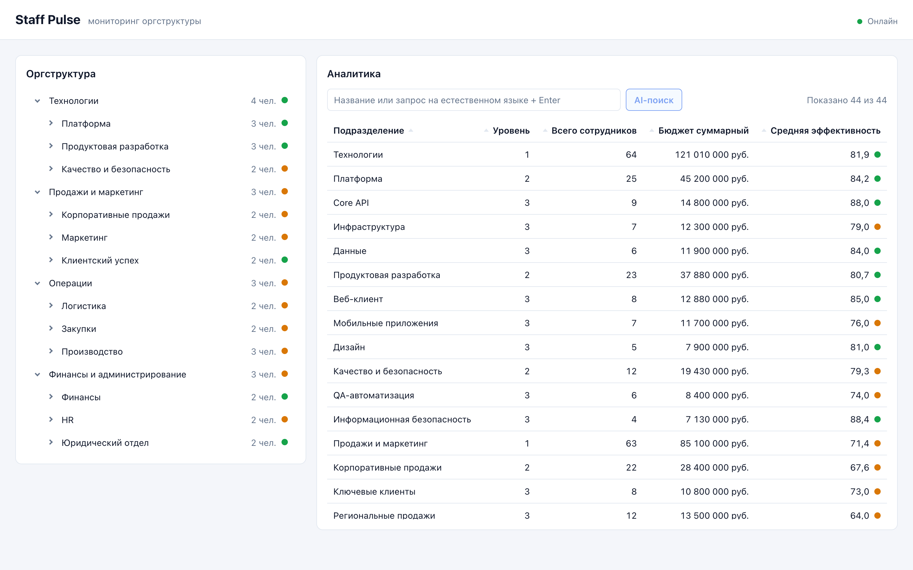
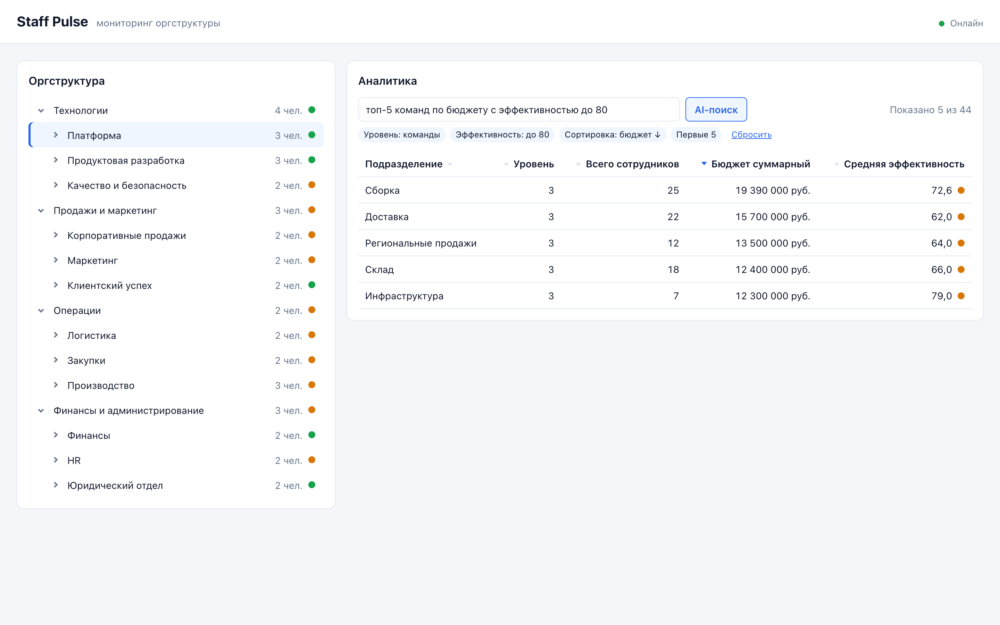
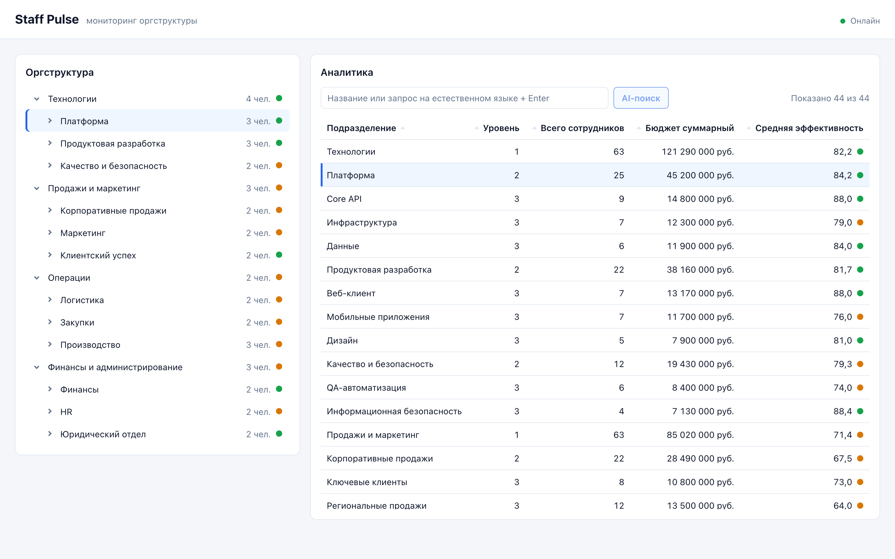
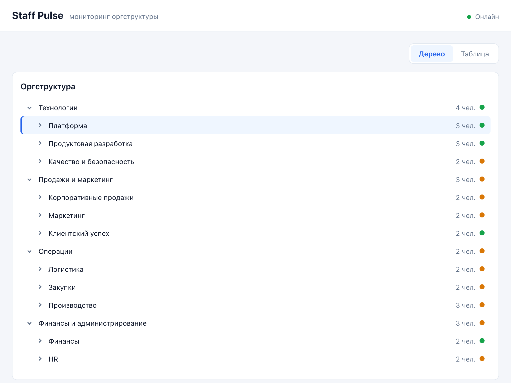

# Staff Pulse

Дашборд оргструктуры компании: дерево подразделений, аналитическая таблица с агрегатами по поддереву, live-обновления через WebSocket и поиск на естественном языке (OpenAI).

- **client** — React 19, Vite, TypeScript, TanStack Query, styled-components, zod;
- **backend** — mock API на Express 5 и TypeScript: REST, WebSocket, Awilix DI;
- **production** — nginx (статика с gzip, прокси API и WebSocket) и Docker Compose.



## Быстрый старт (Docker Compose)

Нужен Docker с Compose v2.

```bash
cp .env.example .env      # необязательно: у всех переменных есть значения по умолчанию
docker-compose up --build # или: docker compose up --build
```

| Что | Адрес |
|---|---|
| Приложение (nginx: SPA + `/api` + `/api/live`) | http://localhost:5173 |
| Backend напрямую (для отладки) | http://localhost:8080/api/org-tree |

Остановка: `docker-compose down`.

### AI-поиск

AI-поиск включается ключом OpenAI в `.env`:

```dotenv
OPENAI_API_KEY=sk-...
# OPENAI_MODEL=gpt-5.6-luna
```

После этого перезапустите приложение: `make start` или `docker-compose up -d`. Без ключа приложение работает полностью, а строка поиска фильтрует по названию.

Как пользоваться: введите запрос и нажмите **Enter** или **AI-поиск**. Примеры:

- `топ-5 команд по бюджету`
- `отделы с эффективностью ниже 60`
- `команды больше 10 человек и бюджетом до 15 млн`

Над таблицей появятся условия, которые распознала модель, и кнопка «Сбросить». Если AI недоступен, остаётся текстовый поиск с пояснением.



## Makefile

| Команда | Что делает |
|---|---|
| `make build-server` | Сборка backend → `backend/dist/` |
| `make build-client` | Сборка client → `client/dist/` и проверка бюджета бандла (≤ 200 КБ gzip) |
| `make build` | Всё приложение: `build-server` + `build-client` + Docker-образы (`docker compose build`) |
| `make test-server` | Backend: typecheck, unit-, integration- и contract-тесты |
| `make test-client` | Client: typecheck, lint, тесты |
| `make test` | Все тесты |
| `make start` | Запуск в Docker в фоне (`docker compose up -d --build`) |
| `make stop` | Остановка (`docker compose down`) |
| `make logs` | Логи обоих сервисов |
| `make help` | Список команд |

При первом запуске (или после изменения `package-lock.json`) зависимости ставятся автоматически. Если установлен только старый `docker-compose`, используйте `make start COMPOSE=docker-compose`.

## Локальная разработка без Docker

Нужен Node.js 22+.

```bash
cd backend && npm install && npm run dev   # http://localhost:8080
cd client  && npm install && npm run dev   # http://localhost:5173, /api и /api/live проксируются на :8080
```

Для AI-поиска в dev: `OPENAI_API_KEY=sk-... npm run dev` в `backend/`.

## Конфигурация (`.env`)

| Переменная | По умолчанию | Назначение |
|---|---|---|
| `CLIENT_PORT` | `5173` | Порт приложения на хосте |
| `BACKEND_PORT` | `8080` | Порт backend на хосте |
| `LIVE_UPDATES_ENABLED` | `true` | Симулятор изменений данных |
| `LIVE_UPDATE_INTERVAL_MS` | `3000` | Период изменений |
| `LIVE_UPDATE_MAX_NODES` | `3` | Максимум узлов за такт |
| `LIVE_HEARTBEAT_INTERVAL_MS` | `15000` | Ping и heartbeat WebSocket |
| `OPENAI_API_KEY` | пусто | Ключ OpenAI; пусто — AI-поиск выключен |
| `OPENAI_MODEL` | `gpt-5.6-luna` | Модель OpenAI |
| `OPENAI_BASE_URL` | `https://api.openai.com/v1` | Базовый URL Responses API |
| `AI_SEARCH_TIMEOUT_MS` | `15000` | Таймаут запроса к LLM |

## Документация

| Документ | О чём |
|---|---|
| [`docs/staff_pulse_assignment.md`](docs/staff_pulse_assignment.md) | Исходное задание |
| [`docs/architecture.md`](docs/architecture.md) | Слои backend и client, поток данных от API до UI, live-обновления, AI-поиск, nginx, Docker, Makefile, тестирование |
| [`docs/data-model.md`](docs/data-model.md) | Контракт API, дерево, алгоритм агрегации, контракт WebSocket-патча, инкрементальный пересчёт, AI-фильтр |
| [`docs/adr/`](docs/adr/) | Архитектурные решения |
| [`backend/docs/openapi.yml`](backend/docs/openapi.yml) | OpenAPI 3.1 (Swagger) спецификация REST API и сообщений WebSocket |
| [`docs/screenshots/`](docs/screenshots/) | Скриншоты |

Спецификацию можно открыть в [Swagger Editor](https://editor.swagger.io/) (File → Import file). Её соответствие коду проверяют контрактные тесты `backend/tests/contract/`.

ADR:

1. [001 — серверное состояние через TanStack Query](docs/adr/001-server-state-tanstack-query.md)
2. [002 — runtime-валидация ответов](docs/adr/002-runtime-response-validation.md)
3. [003 — раскрытие дерева по умолчанию](docs/adr/003-tree-default-expansion.md)
4. [004 — агрегация и мемоизация](docs/adr/004-aggregation-and-memoization.md)
5. [005 — live-обновления через WebSocket](docs/adr/005-live-updates-websocket.md)
6. [006 — AI-поиск: структурированный фильтр](docs/adr/006-ai-search-structured-filter.md)

## Этапы

Каждый этап — отдельный коммит с тегом.

| Тег | Этап | Содержание |
|---|---|---|
| `step/1` | 01 FOUNDATION | Mock API, scaffold клиента, загрузка и валидация данных, дерево |
| `step/2` | 02 CORE | Аналитическая таблица, агрегация, сортировка, фильтр, синхронизация выбора, адаптивная раскладка |
| `step/3` | 03 POLISH | Live-обновления (WebSocket, backoff, индикатор), подсветка изменений, клавиатурная навигация, анимации |
| `step/4` | 04 BONUS | Docker/`.env`, nginx + gzip, бюджет бандла, AI-поиск (OpenAI), OpenAPI, Makefile, документация |

Production-бандл: ≈ 124 КБ gzip при лимите 200 КБ. Лимит проверяется при `make build-client` и при сборке Docker-образа.

<details>
<summary>Ещё скриншоты</summary>

Выбор в таблице синхронизирован с деревом:



Ширина < 1280 px — переключатель «Дерево / Таблица»:



</details>

## AI в разработке

Проект сделан с AI-ассистентом Claude в режиме агента: он писал код, тесты, конфигурацию и документацию. Я ставил задачи по этапам, принимал архитектурные решения, проверял результат и отправлял на доработку.

### Что сгенерировано

- Код backend и client целиком: слои, компоненты, хуки, стили.
- Тесты. Работа шла по TDD: сначала тесты, затем реализация.
- Dockerfile, `docker-compose.yml`, конфиг nginx, Makefile, скрипт проверки размера бандла.
- `docs/architecture.md`, `docs/data-model.md`, ADR, `openapi.yml`, этот README.
- Seed-данные оргструктуры (44 узла).
- Промпт и JSON Schema для AI-поиска.

### Что переделано по моему ревью и почему

| Было | Стало | Почему |
|---|---|---|
| Собственный хук загрузки данных (кэш, отмена, состояния) | TanStack Query | Не писать и не поддерживать то, что решено готовой библиотекой: кэш, SWR, structural sharing, отмена ([ADR-001](docs/adr/001-server-state-tanstack-query.md)) |
| Тесты рядом с модулями вперемешку | Каталоги `__tests__/` в каждом модуле | Структура чище, модули и тесты легче читать |
| Относительные импорты, ручное создание зависимостей, общие названия каталогов данных | Абсолютные импорты `@/`, DI на Awilix, явное разделение `models` / `dto` / `mappers` | Слои backend видны по структуре, зависимости подменяются в тестах без моков модулей |
| Health-check эндпоинт | Удалён | Задание его не требует, лишний код |
| Сортировка по двойному клику «мигала» (два переворота порядка), что выглядело как медленная таблица | Клик переключает ↑/↓, второй клик двойного игнорируется | Проблема была в UX, а не в производительности: замер показал 1–3 мс |
| Узел дерева раскрывался только по стрелке, строка не кликалась | Клик по всей строке выбирает и раскрывает узел | Ожидаемое поведение для дерева |
| ADR про исправление сортировки | Удалён | Это исправление ошибки реализации, а не архитектурное решение |
| Второй параллельный AI-сеанс внёс конфликтующие правки в live-обновления | Правки откачены, реализация сделана в одном потоке | Две версии одной фичи в коде |
| Счётчик результатов переносился на отдельную строку при AI-фильтре (найдено на скриншоте) | Счётчик остаётся в строке поиска, условия — ниже | Визуальная проверка результата |

### Как проверялся результат

- Перед каждым коммитом этапа запускались все тесты: backend (unit, integration, contract), client (unit, компоненты, интеграция). Также typecheck, lint и production-сборка.
- Работа проверялась в браузере по каждому пункту задания: агрегаты сверялись с пересчётом из API, проверялись live-патчи без лишних запросов, backoff при остановке backend, клавиатура и анимации.
- Для AI-поиска вся цепочка client → nginx → backend → Responses API проверена со stub-сервером, совместимым с Responses API: форма запроса `json_schema` + `strict`, разбор ответа, применение фильтра. Скриншот AI-режима сделан так же. Качество распознавания конкретных формулировок зависит от модели и промпта и проверяется вручную с реальным ключом.
