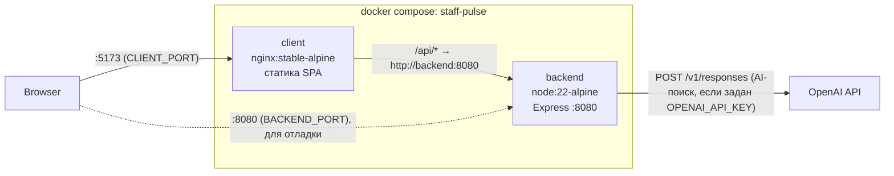
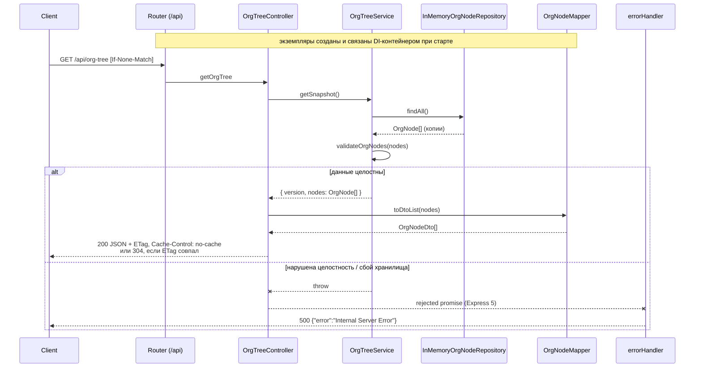
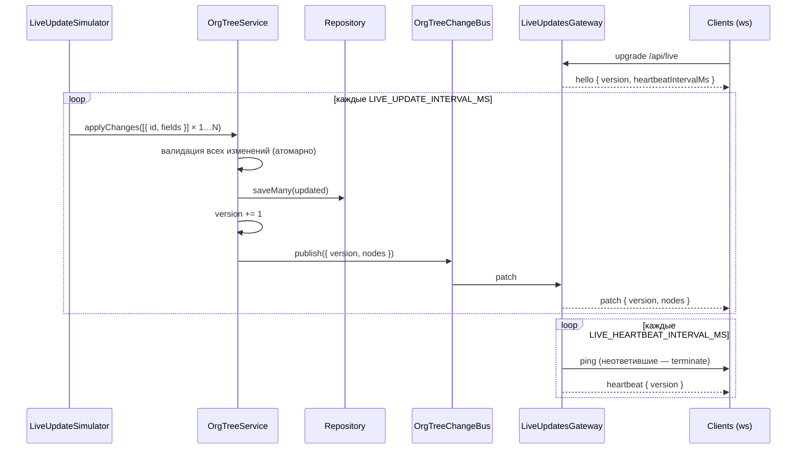
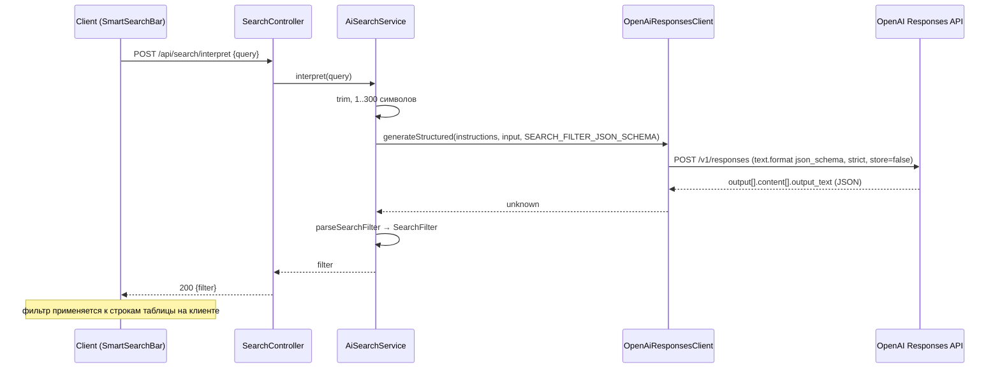
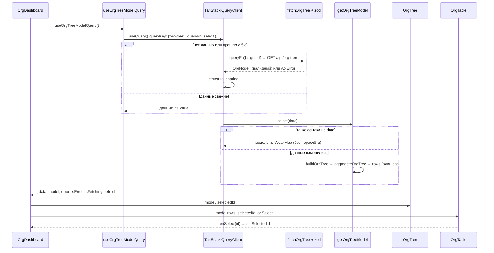
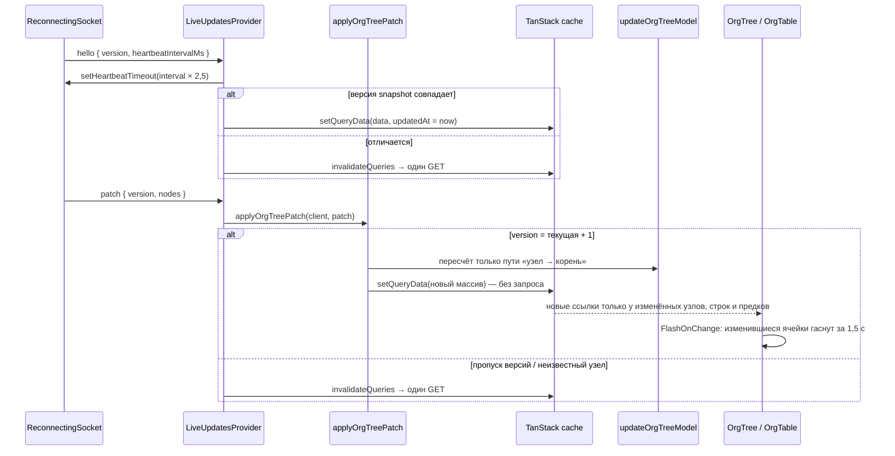

# Архитектура

> Документ дополняется по мере реализации этапов. Описаны **backend**, **client** (этапы 01 FOUNDATION, 02 CORE, 03 POLISH, 04 BONUS), **production-сборка** (nginx, gzip, бюджет бандла), **AI-поиск**, **запуск через Docker Compose** и **Makefile**. REST-контракт — в [`backend/docs/openapi.yml`](../backend/docs/openapi.yml). Модель данных и алгоритм агрегации — в [`data-model.md`](data-model.md). Нетривиальные решения вынесены в [ADR](adr/).

## Обзор

```
repo/
├── backend/             # Express 5 + TypeScript, mock API
│   └── docs/openapi.yml # OpenAPI 3.1 спецификация REST API
├── client/              # Vite + React + TypeScript, SPA
├── docs/                # architecture, data-model, ADR, задание
├── docker-compose.yml   # запуск всего приложения одной командой
├── Makefile             # build/test/start/stop
└── .env.example         # порты, live-обновления, OpenAI
```



Браузер обращается к одному origin (`:5173`). Nginx в контейнере `client` отдаёт собранную SPA и проксирует `/api/*` в контейнер `backend` по внутренней сети Compose. Поэтому CORS не нужен, а клиент ходит на относительный путь `/api/...` одинаково в dev и в production.

## Backend

Mock API на **Express 5 + TypeScript** (ESM, `strict`). Отдаёт орг-структуру компании плоским списком. Хранилища данных нет: узлы лежат в памяти процесса и загружаются из seed-файла при старте.

### Стек

| Задача | Инструмент |
|---|---|
| HTTP-сервер | Express 5 (async-ошибки обработчиков попадают в error-middleware без обёрток) |
| Live-обновления | [ws](https://github.com/websockets/ws) — WebSocket-сервер на том же HTTP-порту, путь `/api/live` |
| Dependency Injection | [Awilix](https://github.com/jeffijoe/awilix), `InjectionMode.PROXY`, `strict` |
| Язык | TypeScript 5, `module: NodeNext` |
| Абсолютные импорты | `paths` в tsconfig; `tsc-alias` при сборке; `tsx` и Vitest резолвят алиасы сами |
| Dev-режим | `tsx watch` |
| Тесты | Vitest + Supertest, покрытие через `@vitest/coverage-v8` |
| Контейнер | `node:22-alpine`, многоэтапная сборка |

### Слои (REST MVC)

```
            ┌──────────── DI-контейнер (src/di) собирает и внедряет всё ниже ────────────┐
routes → controllers → services → repositories → seeds
              │            │            │
              ▼            └────────────┴──► models  (доменные сущности)
           mappers ──► dto                            (публичный контракт API)
```

Зависимости направлены строго сверху вниз. Ни один слой не создаёт свои зависимости сам, их передаёт контейнер.

| Слой | Каталог | Ответственность | Чего слой **не** делает |
|---|---|---|---|
| **Routes** | `src/routes/` | Связывает HTTP-метод и путь с методом контроллера | Не содержит логики |
| **Controllers** | `src/controllers/` | Вызывает сервис, выставляет HTTP-заголовки, отдаёт DTO через mapper | Не знает, откуда берутся данные, и не проверяет бизнес-правила |
| **Services** | `src/services/` | **Бизнес-логика**: получение орг-дерева и проверка его целостности | Не знает про HTTP (`req`/`res`) и DTO |
| **Repositories** | `src/repositories/` | Доступ к данным через интерфейс `OrgNodeRepository`, сейчас реализация `InMemoryOrgNodeRepository` | Не проверяет данные |
| **Middlewares** | `src/middlewares/` | Сквозные обработчики: 404 и централизованная обработка ошибок | — |
| **DI** | `src/di/` | Composition root: регистрация и время жизни зависимостей | — |

### Данные: Model → Mapper → DTO

| Каталог | Сущность | Назначение |
|---|---|---|
| `src/models/` | `OrgNode` | **Доменная модель.** С ней работают сервисы и репозитории. Типы удобны для логики (`updatedAt: Date`) |
| `src/dto/` | `OrgNodeDto` | **Data Transfer Object**, публичный JSON-контракт API (`updatedAt: string`, ISO 8601). Меняется только вместе с контрактом |
| `src/mappers/` | `OrgNodeMapper` | **Преобразует Model → DTO**: оставляет только поля контракта, сериализует даты. Используется контроллером |
| `src/seeds/` | `orgNodesSeed` | Начальные данные (44 узла) в виде доменных моделей. Регистрируются в контейнере как значение |

Благодаря такому разделению внутренние поля модели не утекут в ответ, даже если их добавят позже: mapper перечисляет поля явно, и это проверяет тест.

### Абсолютные импорты

Во всём коде и тестах используются только абсолютные импорты, относительных нет:

```ts
import { OrgTreeService } from '@/services/org-tree.service.js';   // src/*
import { makeNode } from '@tests/helpers/org-node.factory.js';      // tests/* (только в тестах)
```

| Где | Как резолвится |
|---|---|
| Typecheck / IDE | `compilerOptions.paths` в `tsconfig.json` (`@/*`) и `tsconfig.test.json` (`@/*`, `@tests/*`) |
| Dev (`tsx watch`) | tsx читает `paths` из tsconfig |
| Тесты | `resolve.alias` в `vitest.config.ts`, зеркально `paths` |
| Production (`dist/`) | `npm run build` = `tsc && tsc-alias`: `tsc-alias` переписывает `@/…` в относительные пути, и Node запускает `dist` без загрузчиков |

Расширение `.js` в импортах обязательно из-за `module: NodeNext` (нативный ESM в Node).

### Dependency Injection

Используется контейнер **Awilix** (`src/di/container.ts`).

- **`InjectionMode.PROXY`.** Конструктор получает один объект-cradle и деструктурирует нужные зависимости: `constructor({ orgNodeRepository }: OrgTreeServiceDeps)`. Декораторы, `reflect-metadata` и разбор имён параметров не нужны, поэтому схема устойчива к минификации.
- **`strict: true`.** Контейнер запрещает утечку времени жизни, например singleton, зависящий от scoped-сервиса.
- **Каждый класс сам объявляет интерфейс своих зависимостей** (`*Deps`) и не знает про контейнер. В unit-тестах классы создаются через `new` с моками.
- **Тип `Cradle`** описывает всё, что можно получить из контейнера. `container.resolve('orgTreeService')` типизирован.

| Ключ | Регистрация | Lifetime | Тип в `Cradle` |
|---|---|---|---|
| `config` | `asValue(loadConfig(process.env))` | — | `AppConfig` |
| `orgNodesSeed` | `asValue(orgNodesSeed)` | — | `readonly OrgNode[]` |
| `orgNodeRepository` | `asClass(InMemoryOrgNodeRepository)` | singleton | `OrgNodeRepository` |
| `orgNodeMapper` | `asClass(OrgNodeMapper)` | singleton | `OrgNodeMapper` |
| `random` | `asValue(Math.random)` | — | `() => number` |
| `orgTreeChangeBus` | `asClass(OrgTreeChangeBus)` | singleton | `OrgTreeChangeBus` |
| `orgTreeService` | `asClass(OrgTreeService)` | singleton | `OrgTreeServiceApi` (reader + writer) |
| `orgTreeController` | `asClass(OrgTreeController)` | singleton | `OrgTreeController` |
| `liveUpdateSimulator` | `asClass(LiveUpdateSimulator)`, disposer `stop()` | singleton | `LiveUpdateSimulator` |
| `liveUpdatesGateway` | `asClass(LiveUpdatesGateway)`, disposer `close()` | singleton | `LiveUpdatesGateway` |

Граф зависимостей:

```
orgTreeController ──┬─► orgTreeService ──┬─► orgNodeRepository ──► orgNodesSeed
                    └─► orgNodeMapper    └─► orgTreeChangeBus
liveUpdateSimulator ──► orgTreeService, config, random
liveUpdatesGateway  ──► orgTreeChangeBus, orgTreeService, orgNodeMapper, config
```

Все сервисы stateless (кроме in-memory хранилища, которое должно быть одно на процесс), поэтому все они singleton и request scope не нужен.

**Запуск** (`src/index.ts`): `createAppContainer(config)` → `createApp(container)` → `listen`. К HTTP-серверу подключается `liveUpdatesGateway.attach(server)`, при `LIVE_UPDATES_ENABLED` запускается симулятор. При SIGTERM/SIGINT `container.dispose()` вызывает disposers (остановить симулятор, закрыть WebSocket-клиентов), затем закрывается HTTP-сервер.

**Подмена в тестах.** `tests/helpers/test-app.ts` собирает настоящий контейнер и заменяет выбранные регистрации через `asValue`:

```ts
createTestApp({ orgNodesSeed: [makeNode()] });                         // другие данные
createTestApp({ orgTreeService: { getSnapshot: vi.fn().mockRejectedValue(err), getVersion: () => 0, applyChanges: vi.fn() } }); // сбой сервиса
```

### Структура каталогов

```
backend/
├── src/
│   ├── index.ts                         # bootstrap: контейнер → app → listen, graceful shutdown
│   ├── app.ts                           # createApp(container)
│   ├── config.ts                        # PORT / HOST / NODE_ENV / LIVE_* / OPENAI_*
│   ├── di/
│   │   └── container.ts                 # Cradle, createAppContainer()
│   ├── routes/
│   │   ├── index.ts                     # /api router
│   │   ├── org-tree.routes.ts           # GET /api/org-tree
│   │   └── search.routes.ts             # GET /api/search/status, POST /api/search/interpret (express.json 8kb)
│   ├── controllers/
│   │   ├── org-tree.controller.ts       # OrgTreeController
│   │   └── search.controller.ts         # SearchController: ошибки сервиса → 400 / 502 / 503
│   ├── clients/
│   │   └── openai-responses.client.ts   # LlmClient (порт) + OpenAiResponsesClient (Responses API, Structured Outputs)
│   ├── services/
│   │   ├── org-tree.service.ts          # OrgTreeService: getSnapshot / getVersion / applyChanges
│   │   ├── org-tree.validator.ts        # правила целостности дерева
│   │   ├── live-update-simulator.ts     # mock-источник изменений (setInterval)
│   │   ├── ai-search.service.ts         # AiSearchService: запрос → LLM → валидированный SearchFilter
│   │   ├── ai-search.prompt.ts          # системные инструкции для LLM
│   │   ├── search-filter.json-schema.ts # JSON Schema фильтра (strict)
│   │   └── search-filter.validator.ts   # parseSearchFilter: защитная валидация и нормализация ответа
│   ├── events/
│   │   └── org-tree-change-bus.ts       # pub/sub: сервис → транспорты
│   ├── gateways/
│   │   └── live-updates.gateway.ts      # WebSocket /api/live: hello, patch, heartbeat
│   ├── repositories/
│   │   └── org-node.repository.ts       # интерфейс + InMemoryOrgNodeRepository
│   ├── models/
│   │   ├── org-node.model.ts            # OrgNode
│   │   ├── org-tree-patch.model.ts      # OrgNodeChange, OrgTreePatch
│   │   └── search-filter.model.ts       # SearchFilter
│   ├── dto/
│   │   ├── org-node.dto.ts              # OrgNodeDto
│   │   └── live-message.dto.ts          # LiveMessageDto (hello | patch | heartbeat)
│   ├── mappers/
│   │   └── org-node.mapper.ts           # OrgNodeMapper: OrgNode → OrgNodeDto / patch message
│   ├── middlewares/
│   │   ├── not-found.middleware.ts
│   │   └── error-handler.middleware.ts
│   └── seeds/
│       └── org-nodes.seed.ts            # 4 дивизиона → 12 отделов → 28 команд
├── tests/
│   ├── helpers/
│   │   ├── org-node.factory.ts          # makeNode()
│   │   └── test-app.ts                  # createTestApp(overrides) на реальном контейнере
│   ├── unit/                            # config, di, clients, controllers, services, repositories, mappers, middlewares, seeds
│   ├── integration/                     # HTTP (supertest) и WebSocket (ws-клиент на реальном сервере)
│   └── contract/                        # ответы реального приложения ↔ docs/openapi.yml (ajv)
├── docs/
│   └── openapi.yml                      # OpenAPI 3.1
├── Dockerfile
├── vitest.config.ts
├── tsconfig.json                        # сборка (только src), paths @/*
└── tsconfig.test.json                   # typecheck src + tests, paths @/*, @tests/*
```

### Поток запроса `GET /api/org-tree`



1. **Router** передаёт запрос в `OrgTreeController.getOrgTree`. Метод объявлен стрелочным свойством, поэтому `this` сохраняется, когда метод передаётся в Express как функция.
2. **Controller** вызывает `orgTreeService.getSnapshot()` и отдаёт версию в заголовке `X-Data-Version`. Зависит от интерфейса `OrgTreeReader`.
3. **Service** получает `OrgNode[]` из репозитория и проверяет инварианты дерева. Невалидные данные клиенту не отдаются.
4. **Repository** возвращает глубокие копии (включая `Date`), поэтому вызывающий код не может испортить хранилище.
5. **Mapper** превращает модели в `OrgNodeDto[]`.
6. Express считает слабый **ETag** по телу ответа. Если клиент прислал совпадающий `If-None-Match`, уходит `304 Not Modified` без тела.

### Live-обновления (WebSocket)



| Компонент | Слой | Ответственность |
|---|---|---|
| `OrgTreeService.applyChanges` | services | **Бизнес-логика изменений**: проверка существования узлов и правил полей для всего пакета до записи (атомарно), сохранение, `version + 1`, публикация патча |
| `OrgTreeChangeBus` | events | In-process pub/sub. Сервис не знает о транспорте; упавший подписчик не мешает остальным |
| `LiveUpdatesGateway` | gateways | Транспорт (аналог контроллера для WebSocket): upgrade только на `/api/live` (иначе 404), `hello`, рассылка патчей открытым клиентам, heartbeat: ping + прикладное сообщение, отключение «мёртвых» клиентов |
| `LiveUpdateSimulator` | services | Mock-источник данных: раз в интервал меняет 1…`LIVE_UPDATE_MAX_NODES` случайных узлов (performance ±0,5–3 п., бюджет ±3% с шагом 10 000, headcount ±1), всегда валидные значения |
| `OrgNodeMapper.toPatchMessage` | mappers | Модель → DTO патча |

`GET /api/org-tree` и live-канал используют одну версию из `OrgTreeService`, поэтому клиент может проверить, что snapshot и патчи идут без пропусков.

### API

#### `GET /api/org-tree`

Единственный эндпоинт по заданию. Возвращает **плоский массив** `OrgNodeDto`. Иерархия задаётся через `parentId`, дерево строит клиент.

```jsonc
[
  {
    "id": "d1-1",                          // string, уникальный
    "name": "Платформа",                   // string, непустой
    "parentId": "d1",                      // string | null (null — корень, дивизион)
    "headcount": 3,                        // integer ≥ 0, сотрудники самого узла
    "budget": 6200000,                     // number ≥ 0, руб., бюджет самого узла
    "performance": 85,                     // number 0–100
    "updatedAt": "2026-09-01T09:05:00.000Z" // ISO 8601, UTC
  }
]
```

`headcount` и `budget` относятся **только к самому узлу**. Суммы по поддереву и средняя эффективность, взвешенная по headcount, считаются на клиенте (этап 02).

| Статус | Когда | Тело |
|---|---|---|
| `200` | Успех (в том числе пустые данные) | `OrgNodeDto[]`, возможно `[]` |
| `304` | `If-None-Match` совпал с текущим ETag | — |
| `404` | Другие методы (`POST`/`PUT`/`PATCH`/`DELETE`) и неизвестные пути | `{"error":"Not Found"}` |
| `500` | Нарушена целостность данных или внутренняя ошибка | `{"error":"Internal Server Error"}`, без деталей |

Заголовки ответа: `Content-Type: application/json; charset=utf-8`, `Cache-Control: no-cache`, `ETag: W/"…"`, `X-Data-Version: <n>` — версия данных для выравнивания с live-патчами.

#### `GET /api/search/status`

`{"aiEnabled": boolean}` — задан ли `OPENAI_API_KEY`. Клиент по нему решает, показывать ли кнопку «AI-поиск». `Cache-Control: no-store`.

#### `POST /api/search/interpret`

Тело `{"query": "топ-3 команды по бюджету"}` (≤ 300 символов после trim, тело ≤ 8 КБ). Ответ `{"filter": SearchFilter}` — контракт в [`data-model.md`, раздел 6](data-model.md#6-ai-фильтр-поиска).

| Статус | Когда | Тело |
|---|---|---|
| `200` | Фильтр получен и прошёл валидацию | `{"filter": {...}}` |
| `400` | Нет `query`, пустая строка, не строка, длиннее 300 символов, битый JSON | `{"error": "..."}` |
| `413` | Тело больше 8 КБ | `{"error":"Payload Too Large"}` |
| `502` | LLM недоступна: сеть, таймаут, HTTP-ошибка, отказ модели, ответ не по схеме | `{"error":"AI search failed"}`, без деталей |
| `503` | AI-поиск не настроен (нет ключа) | `{"error":"AI search is not configured"}` |

Полная спецификация всех эндпоинтов, включая WebSocket-сообщения, — [`backend/docs/openapi.yml`](../backend/docs/openapi.yml). Контрактные тесты (`tests/contract/openapi.contract.test.ts`) проверяют через ajv, что реальные ответы приложения и примеры в спецификации соответствуют её схемам, и что каждый описанный путь существует.

#### `WS /api/live`

Live-обновления: `hello` при подключении, `patch` на каждое изменение, `heartbeat` по таймеру. Контракт — в [`data-model.md`, раздел 4](data-model.md#4-websocket-патч-live-обновления).

Отдельного health-check эндпоинта нет: задание его не требует.

### Бизнес-правила (`services/org-tree.validator.ts`)

`validateOrgNodes` проверяет, что плоский список образует корректный лес. При первом нарушении бросает `OrgTreeIntegrityError`.

| Правило | Пример нарушения |
|---|---|
| `id` — непустая строка, уникальная | два узла `"x"` |
| `name` — непустая строка | `"   "` |
| `headcount` — целое ≥ 0 | `-1`, `1.5`, `NaN` |
| `budget` — конечное число ≥ 0 | `-1`, `Infinity` |
| `performance` — число в диапазоне 0–100 | `100.1` |
| `updatedAt` — валидная дата | `new Date('x')` |
| `parentId` — `null` или id существующего узла | `"ghost"` |
| Нет циклов, в том числе ссылки на себя | `a → c → b → a` |

Сложность **O(n)**: один проход строит индекс `id → parentId`, второй проверяет ссылки. Циклы ищутся подъёмом к корню с мемоизацией узлов, у которых путь до корня уже подтверждён.

### Кэширование на уровне HTTP

- `Cache-Control: no-cache` — браузер хранит ответ, но **всегда** перепроверяет его у сервера.
- `ETag` зависит от содержимого, поэтому меняется только при реальном изменении данных (это покрыто тестом).
- Повторный запрос с `If-None-Match` без изменений получает `304` без тела.

### Обработка ошибок

- Express 5 сам передаёт отклонённые промисы из async-обработчиков в `errorHandler`, так что `try/catch` в контроллерах не нужен.
- `errorHandler` пишет ошибку в лог, отвечает `500` с общим сообщением и не раскрывает внутренние детали. Если заголовки уже отправлены, в ответ ничего не пишет.
- Клиентские ошибки middleware Express (`status` 4xx и `expose: true`, например битый JSON или слишком большое тело от `express.json`) отдаются со своим статусом и стандартным текстом (`Bad Request`, `Payload Too Large`) и не логируются как сбой.
- Ожидаемые ошибки AI-поиска контроллер переводит в `400`/`502`/`503`; всё остальное пробрасывается в `errorHandler`.
- `notFound` отвечает JSON 404 на всё, что не совпало ни с одним маршрутом.

### Конфигурация

| Переменная | По умолчанию | Описание |
|---|---|---|
| `PORT` | `8080` | Некорректное значение (не целое, вне 1–65535) → `8080` |
| `HOST` | не задан | Пусто → слушать `::` (IPv4 + IPv6). Если явно указать `0.0.0.0`, сервер будет только IPv4 и `localhost` → `::1` на macOS получит отказ |
| `NODE_ENV` | `development` | В Docker-образе `production` |
| `LIVE_UPDATES_ENABLED` | `true` | `false` — симулятор не запускается (канал `/api/live` работает, патчей нет) |
| `LIVE_UPDATE_INTERVAL_MS` | `3000` | Период изменений, минимум 250 мс |
| `LIVE_UPDATE_MAX_NODES` | `3` | Максимум узлов, меняющихся за такт (минимум 1) |
| `LIVE_HEARTBEAT_INTERVAL_MS` | `15000` | Период ping и heartbeat-сообщений |
| `OPENAI_API_KEY` | не задан | Ключ OpenAI. Пусто → AI-поиск выключен (`aiEnabled: false`, `503`), клиент работает как текстовый поиск |
| `OPENAI_MODEL` | `gpt-5.6-luna` | Модель для Structured Outputs |
| `OPENAI_BASE_URL` | `https://api.openai.com/v1` | Базовый URL Responses API (прокси или совместимый шлюз) |
| `AI_SEARCH_TIMEOUT_MS` | `15000` | Таймаут одного запроса к LLM, минимум 1000 |

Конфиг регистрируется в DI-контейнере как значение `config`.

### Тестирование (TDD)

Разработка идёт циклом **red → green → refactor**: сначала тесты на контракт, затем реализация.

| Уровень | Файлы | Что проверяется |
|---|---|---|
| Unit | `tests/unit/di/container.test.ts` | Набор регистраций, конкретные реализации, singleton внутри контейнера и изоляция между контейнерами, связывание seed → repository → service, подмена регистраций |
| Unit | `tests/unit/controllers/…` | Вызов сервиса, маппинг через mapper, `Cache-Control`, привязка `this` |
| Unit | `tests/unit/services/org-tree.validator.test.ts` | Все правила целостности, граничные значения, циклы |
| Unit | `tests/unit/services/org-tree.service.test.ts` | Вызов репозитория, пустые данные, отказ на невалидных данных, проброс ошибок (репозиторий замокан) |
| Unit | `tests/unit/repositories/…` | Порядок, изоляция от seed-массива, защитные копии |
| Unit | `tests/unit/mappers/…` | Точная форма DTO, ISO-даты, отсутствие лишних полей |
| Unit | `tests/unit/middlewares/…` | 500 без утечки деталей, поведение при `headersSent` |
| Unit | `tests/unit/seeds/…` | ≥ 40 узлов, ≥ 3 уровня, проходит валидатор |
| Unit | `tests/unit/config.test.ts` | Разбор `PORT`/`HOST`/`NODE_ENV` и `LIVE_*` с защитой от некорректных значений |
| Unit | `tests/unit/services/org-tree.service.test.ts` (applyChanges) | Изменение только переданных полей, версия +1 на пакет, публикация патча, пустой пакет, атомарный отказ при неизвестном узле или невалидном значении |
| Unit | `tests/unit/events/…` | Доставка всем подписчикам, отписка, изоляция упавшего подписчика |
| Unit | `tests/unit/services/live-update-simulator.test.ts` | Валидность сгенерированных метрик, отскок от границ, 1…N различных узлов за такт, интервал, start/stop, повторный start, падение такта не останавливает симулятор |
| Integration | `tests/integration/live-updates.gateway.test.ts` | Реальный HTTP-сервер + ws-клиенты: `hello` с версией, рассылка патча всем, heartbeat с версией, отключение клиента без pong, 404 на другой путь, `close()` (идемпотентно), ошибки сокета, отправка только открытым |
| Integration | `tests/integration/org-tree.api.test.ts` | 200/JSON/форма, `[]`, ETag + 304, `X-Data-Version` и его рост после `applyChanges`, смена ETag при смене данных, 500 при сбое внедрённого сервиса, 404 на запись |
| Integration | `tests/integration/app.test.ts` | 404 JSON, health-check отсутствует, нет `X-Powered-By` |
| Unit | `tests/unit/clients/openai-responses.client.test.ts` | Без ключа запрос не уходит; форма запроса (`text.format: json_schema, strict`, `store: false`, Bearer, таймаут); base URL; разбор `output[].content[].output_text` и `output_text`; сеть, таймаут, HTTP-статус без утечки тела, отказ модели, битый JSON, `incomplete` |
| Unit | `tests/unit/services/search-filter.validator.test.ts` | Полный фильтр, пустой фильтр, trim имени, уровни (дубли, порядок, неизвестные), перевёрнутый диапазон, клэмп 0–100, отрицательные значения, сортировка, `limit` |
| Unit | `tests/unit/services/ai-search.service.test.ts` | Валидация запроса до вызова LLM, передача схемы и инструкций, 503-сценарий без ключа, обёртка сбоев LLM и невалидного ответа, проброс неожиданных ошибок; JSON Schema совместима со strict mode и совпадает с моделью |
| Integration | `tests/integration/search.api.test.ts` | `status`, `200` с фильтром, `400` (нет тела / пусто / не строка / битый JSON), `413`, `503`, `502` без утечки деталей, `no-store` |
| Contract | `tests/contract/openapi.contract.test.ts` | Спецификация — OpenAPI 3.1, схемы компилируются, примеры валидны, описанные пути существуют; реальные ответы всех эндпоинтов и live-сообщения соответствуют схемам |

Покрытие: 99,7% строк, 98,8% statements, 94,5% веток (непокрыты гонки при отправке в закрывающийся сокет и защитные ветки разбора ответа OpenAI). Из подсчёта исключены `src/index.ts` (bootstrap процесса), `src/models` и `src/dto` (только типы).

### Команды

```bash
cd backend
npm install
npm run dev            # tsx watch, http://localhost:8080
npm test               # все тесты
npm run test:watch     # TDD-режим
npm run test:coverage  # отчёт покрытия (text + coverage/index.html)
npm run typecheck      # tsc по src + tests
npm run build          # tsc + tsc-alias → dist/
```

### Docker

Многоэтапный `backend/Dockerfile` на `node:22-alpine`:

1. `deps` — `npm ci` со всеми зависимостями;
2. `build` — `tsc && tsc-alias` → `dist/`;
3. `prod-deps` — `npm ci --omit=dev`;
4. `runtime` — только `dist/`, production-`node_modules` и `package.json`; пользователь `node`, `EXPOSE 8080`.

Тесты и конфиги разработки исключены через `.dockerignore`.

```bash
docker build -t staff-pulse-backend backend
docker run -d --name staff-pulse-backend -p 8080:8080 staff-pulse-backend
```

`EXPOSE` только документирует порт. Чтобы сервер был доступен с хоста, нужен `-p 8080:8080`.

### AI-поиск

Решение и альтернативы — [ADR-006](adr/006-ai-search-structured-filter.md). Коротко:



- **LLM только переводит запрос в фильтр.** Данные в модель не отправляются, фильтрация выполняется на клиенте над теми же строками таблицы, поэтому live-патчи сразу отражаются в отфильтрованной выборке.
- **Порт `LlmClient`** отделяет бизнес-логику от провайдера: сервис знает только `isConfigured()` и `generateStructured()`. Транспорт (`fetchFn`) внедряется через DI, в тестах подменяется.
- **Двойная защита контракта:** strict JSON Schema на стороне OpenAI и `parseSearchFilter` на backend (типы, допустимые значения, нормализация: пустое имя → `null`, `min > max` → обмен, эффективность в 0–100). На клиенте ответ ещё раз проверяется zod-схемой.
- **Ключ только на сервере** (`OPENAI_API_KEY` в `.env`), в браузер не попадает.

### Точки расширения

- **Реальный источник изменений.** Вместо `LiveUpdateSimulator` — любой код, вызывающий `orgTreeService.applyChanges` (REST-эндпоинт, очередь). Шлюз и клиент не меняются.
- **Другой транспорт** (SSE) — ещё один подписчик `OrgTreeChangeBus`.
- **Горизонтальное масштабирование** — заменить in-process шину на внешнюю (Redis Pub/Sub) и хранить версию в общем хранилище.
- **Другое хранилище.** Реализовать `OrgNodeRepository` и заменить одну регистрацию `orgNodeRepository` в `src/di/container.ts`. Остальные слои не затрагиваются.

## Client

SPA на **Vite 8 + React 19 + TypeScript 6**: дерево оргструктуры и аналитическая таблица с live-обновлениями по WebSocket. Стили на **styled-components**, запросы и кэш через **TanStack Query**, runtime-валидация через **zod**. UI-библиотек нет.

### Стек

| Задача | Инструмент |
|---|---|
| Сборка / dev-сервер | Vite 8 + `@vitejs/plugin-react` |
| UI | React 19 |
| Стили | styled-components 6 (тема через `ThemeProvider`, без inline-CSS) |
| Валидация ответа API | zod 4 |
| Запросы и кэш | TanStack Query 5 (stale-while-revalidate), см. [ADR-001](adr/001-server-state-tanstack-query.md) |
| Live-обновления | нативный `WebSocket` + собственный `ReconnectingSocket` (backoff, watchdog, online/offline), см. [ADR-005](adr/005-live-updates-websocket.md) |
| Тесты | Vitest + Testing Library + jsdom |
| Линтер | oxlint |
| Production-раздача | nginx (`nginx:stable-alpine`) |

### Слои

Структура по мотивам Feature-Sliced Design: каждый слой импортирует только слои ниже себя.

```
app  →  widgets  →  features  →  entities  →  shared
```

| Слой | Каталог | Ответственность |
|---|---|---|
| **app** | `src/app/` | Точка сборки: провайдеры (тема, глобальные стили, `QueryClientProvider`), единый `queryClient`, каркас страницы |
| **widgets** | `src/widgets/` | Готовые блоки интерфейса. `org-dashboard` — состояния данных, раскладка (split-view или переключатель) и общее выделение. `org-tree` — дерево. `org-table` — аналитическая таблица с сортировкой и фильтром |
| **features** | `src/features/live-updates/`, `src/features/ai-search/` | «Данные обновляются в реальном времени»: `LiveUpdatesProvider` (сокет → кэш), статус соединения (`useLiveStatus`), `ConnectionIndicator`. «Поиск на естественном языке»: API и zod-контракт фильтра, `applySearchFilter`, `describeSearchFilter`, хук `useSmartSearch`, `SmartSearchBar` |
| **entities** | `src/entities/org-node/` | Предметная сущность «узел оргструктуры»: схема (`model`), запрос и хуки (`api`), построение дерева, агрегация, модель и её инкрементальное обновление (`lib`), live-сообщения, версия данных и применение патча (`live`), `PerformanceIndicator` (`ui`) |
| **shared** | `src/shared/` | Код без привязки к предметной области: HTTP-клиент, ошибки и фабрика `QueryClient` (`api`), форматирование, дебаунс, media query, backoff и `ReconnectingSocket` (`lib`), тема (`styles`), базовые компоненты, включая `FlashOnChange` и `Collapse` (`ui`) |

```
client/src/
├── main.tsx
├── app/
│   ├── app.tsx                        # каркас: header (+ индикатор соединения) + main; LiveUpdatesProvider
│   ├── app-providers.tsx              # ThemeProvider, GlobalStyle, QueryClientProvider
│   └── query-client.ts                # единый QueryClient приложения
├── widgets/
│   ├── org-dashboard/
│   │   ├── org-dashboard.tsx          # загрузка / ошибка / пусто; split-view ≥1280px или переключатель; selectedId
│   │   └── org-dashboard.styles.ts
│   ├── org-tree/
│   │   ├── org-tree.tsx               # role="tree"; раскрытие предков выбранного узла
│   │   ├── org-tree-item.tsx          # role="treeitem", memo, aria-selected, scrollIntoView, Collapse, FlashOnChange
│   │   ├── org-tree.styles.ts
│   │   └── use-tree-expansion.ts      # isExpanded / toggle / expand
│   └── org-table/
│       ├── org-table.tsx              # role="grid"; сортировка, фильтр, выбор, клавиатура (roving tabindex), подсветка
│       ├── org-table.styles.ts
│       └── lib/
│           └── filter-rows.ts         # filterRowsByName (регистр, ё ≡ е)
├── features/live-updates/
│   ├── live-updates-provider.tsx      # сокет → applyOrgTreePatch / resync; статус в контекст
│   ├── live-url.ts                    # ws(s)://origin/api/live, HEARTBEAT_TIMEOUT_FACTOR
│   ├── live-status-context.ts, use-live-status.ts
│   └── ui/connection-indicator.tsx    # «Онлайн» / «Нет связи · повтор через N с» + «Переподключиться»
├── features/ai-search/
│   ├── model/search-filter.schema.ts  # zod: SearchFilter, ответы status / interpret, EMPTY_SEARCH_FILTER
│   ├── model/use-smart-search.ts      # текстовый режим ↔ AI-фильтр, отбрасывание устаревших ответов, fallback
│   ├── api/ai-search.api.ts           # fetchAiSearchStatus, interpretSearchQuery, useAiSearchStatusQuery, useInterpretSearchMutation
│   ├── lib/apply-search-filter.ts     # фильтр → строки таблицы (условия, top-N по сортировке фильтра)
│   ├── lib/describe-search-filter.ts  # фильтр → «чипы» на русском
│   └── ui/smart-search-bar.tsx        # role="search": поле, кнопка «AI-поиск», чипы, «Сбросить», уведомление
├── entities/org-node/
│   ├── model/org-node.schema.ts       # zod-схема ответа + тип OrgNode
│   ├── model/performance.ts           # пороги и уровни эффективности
│   ├── lib/build-org-tree.ts          # плоский список → лес, O(n)
│   ├── lib/aggregate-org-tree.ts      # агрегаты поддеревьев, O(n), без рекурсии
│   ├── lib/org-tree-model.ts          # forest + byId + stats + rows; getOrgTreeModel (WeakMap-мемо), peek/prime
│   ├── lib/update-org-tree-model.ts   # инкрементальный пересчёт пути «узел → корень»
│   ├── lib/sort-rows.ts               # sortRows, applySortToggle (общие для таблицы и AI-фильтра)
│   ├── live/live-message.schema.ts    # zod: hello | heartbeat | patch
│   ├── live/data-version.ts           # версия snapshot по ссылке на массив данных
│   ├── live/apply-org-tree-patch.ts   # patch → кэш TanStack: applied | ignored | resync
│   ├── api/org-tree.api.ts            # fetchOrgTree(signal) + X-Data-Version
│   ├── api/org-tree.query.ts          # useOrgTreeQuery, useOrgTreeModelQuery (select), structuralSharing с версией
│   └── ui/performance-indicator.tsx
├── shared/
│   ├── api/                           # http-client, get-error-message, query-client
│   ├── lib/                           # format, normalize-search-text, use-debounced-value, use-media-query, prefers-reduced-motion
│   ├── lib/live/                      # backoff, reconnecting-socket
│   ├── styles/                        # theme, GlobalStyle, типизация DefaultTheme
│   └── ui/                            # LoadingState, ErrorState, EmptyState, Button, Panel, FlashOnChange, Collapse
└── test/                              # setup, фикстуры, renderWithProviders, мок matchMedia, FakeWebSocket
                                       # в каждом каталоге модулей — __tests__/ с его тестами
```

Тесты лежат в каталоге `__tests__/` рядом с тестируемыми модулями: `widgets/org-tree/__tests__/org-tree.test.tsx` проверяет `widgets/org-tree/org-tree.tsx`. Импорты в тестах только абсолютные (`@/…`), поэтому перенос файлов их не ломает.

### Поток данных: от API до UI



1. **`OrgDashboard`** вызывает `useOrgTreeModelQuery()`, то есть `useQuery` с ключом `['org-tree']` и `select: getOrgTreeModel`.
2. **TanStack Query** отправляет запрос, только если данных нет или они старше `staleTime` (5 с): при монтировании и при фокусе окна. Одновременные запросы объединяются, при фоновой перепроверке старые данные остаются на экране. `signal` из `queryFn` отменяет запрос, когда компонентов, использующих запрос, не остаётся.
3. **`getJson` + zod** проверяют ответ: невалидный ответ превращается в `ApiError(kind: 'validation')`, см. [ADR-002](adr/002-runtime-response-validation.md).
4. **Structural sharing** сохраняет ссылку на `data`, если ответ не изменился.
5. **`getOrgTreeModel`** мемоизирован по ссылке на `data` через `WeakMap`. Дерево, агрегаты и строки таблицы вычисляются **один раз на каждое реальное изменение данных** и переиспользуются всеми потребителями, см. [ADR-004](adr/004-aggregation-and-memoization.md).
6. **`OrgDashboard`** передаёт одну и ту же модель в `OrgTree` (лес) и `OrgTable` (строки) и хранит общее `selectedId`.

### Кэш запросов (TanStack Query)

Настройки проекта собраны в одном месте, `shared/api/query-client.ts` (`createQueryClient()`). Одна и та же фабрика используется в приложении и в тестах.

| Требование | Как выполнено |
|---|---|
| Stale time 5 с | `staleTime: QUERY_STALE_TIME` (5000) |
| Stale-while-revalidate, без лишних запросов | Встроено: свежие данные отдаются из кэша, устаревшие показываются и перепроверяются в фоне; `refetchOnWindowFocus: true` срабатывает только для устаревших данных |
| Дедупликация | Встроено: один запрос на `queryKey` |
| Отмена при размонтировании | `queryFn: ({ signal }) => fetchOrgTree(signal)`: TanStack отменяет запрос, когда у него не осталось наблюдателей. StrictMode не вызывает двойного запроса |
| Кэш меняется только при реальном изменении данных | `structuralSharing: true`: равные данные сохраняют ссылку, изменённые узлы получают новые ссылки, остальные — прежние |
| Ошибки | `retry: false`: ошибка сразу показывается пользователю, повтор по кнопке «Повторить» (`refetch`); ранее загруженные `data` сохраняются |

Каждое из этих требований закреплено тестом в `entities/org-node/api/__tests__/org-tree.query.test.tsx`. Если выключить `structuralSharing`, падают 4 теста, а если убрать мемоизацию модели — 2 теста.

### Live-обновления



| Требование | Реализация |
|---|---|
| Транспорт | WebSocket `/api/live` через тот же origin (nginx `location = /api/live` с `Upgrade`, Vite proxy `ws: true`) |
| Патч без полного рефетча | `applyOrgTreePatch` пишет данные прямо в кэш TanStack (`setQueryData`); запрос `GET` делается только при пропуске версий или рестарте сервера |
| Пересчёт только затронутых | `updateOrgTreeModel` пересчитывает узел и его предков; модель регистрируется для нового массива, поэтому `select` не запускает полную агрегацию (тест: `aggregateOrgTree` не вызывается, `computeUnitStats` вызывается 3 раза для пути глубиной 3) |
| Подсветка обновлённых ячеек | `FlashOnChange` сравнивает **отображаемое** значение, при изменении включает CSS-анимацию фона на 1,5 с; повторное изменение перезапускает её. Сортировка и фильтрация не подсвечивают (значение не меняется). В таблице — итоги по сотрудникам, бюджету и эффективности (включая предков), в дереве — headcount |
| Индикатор соединения | `ConnectionIndicator` в шапке: «Онлайн» (зелёный), «Подключение…», «Нет связи · повтор через N с» с кнопкой «Переподключиться», «Нет сети», «Отключено»; `role="status"` |
| Экспоненциальный backoff | `computeBackoffDelay`: 500 мс × 2^attempt, максимум 30 с, джиттер ±20 %; сброс после успешного подключения |
| Обнаружение «мёртвого» соединения | Watchdog: попытка, не открывшаяся за 10 с, и соединение без сообщений дольше `2,5 × heartbeatIntervalMs` закрываются и переподключаются. На nginx `proxy_connect_timeout 5s`, чтобы при остановленном backend попытка не висела 60 с |
| Сеть | При `offline` сокет закрывается и попытки не тратятся; при `online` — переподключение сразу |
| Отмена при размонтировании | Провайдер закрывает сокет и снимает таймеры и слушатели |
| Свежесть кэша | Heartbeat с совпадающей версией обновляет `dataUpdatedAt`: пока канал жив, focus и повторное монтирование не делают запросов |

Проверено в браузере (Docker): за 9 с — 10 подсветок и ни одного дополнительного `GET`; при остановке backend видны переходы 0,5 → 1 → 2 → 4 с, после запуска — «Онлайн» и ровно один resync-запрос.

### Агрегация

Суммарные показатели включают узел и всех его потомков. Алгоритм, формулы и сложность описаны в [`data-model.md`](data-model.md).

| Показатель | Формула по поддереву |
|---|---|
| Всего сотрудников | Σ `headcount` |
| Бюджет суммарный | Σ `budget` |
| Средняя эффективность | Σ(`performance` × `headcount`) / Σ `headcount`; если Σ `headcount` = 0, то простое среднее `performance` |

### Состояния UI (`OrgDashboard`)

| Условие | Что показывается |
|---|---|
| Нет `data`, идёт запрос (в том числе повтор после ошибки) | `LoadingState` (`role="status"`, `aria-busy`) |
| Нет `data`, `isError`, запрос не идёт | `ErrorState` (`role="alert"`) с понятным текстом из `getErrorMessage` и кнопкой «Повторить» |
| `data = []` | `EmptyState` «Подразделений пока нет» (без переключателя и таблицы) |
| `data` есть | Дерево и таблица: рядом при ширине ≥ 1280px, иначе по переключателю |
| `data` есть, фоновая перепроверка упала | Контент остаётся, сверху компактный `ErrorState` «Не удалось обновить данные» с «Повторить» |

### Раскладка

- **≥ 1280px** (`SPLIT_VIEW_MEDIA_QUERY`): split-view, дерево и таблица рядом (сетка 1 : 2). Каждая панель прокручивается внутри себя.
- **< 1280px:** переключатель «Дерево / Таблица» (`role="group"`, кнопки с `aria-pressed`), показывается одна панель, по умолчанию дерево.
- Ширина отслеживается через `useMediaQuery` (`useSyncExternalStore` + `matchMedia`), раскладка перестраивается при ресайзе окна.
- Выбранный узел хранится в `OrgDashboard` и не сбрасывается при смене режима. Выбирать можно и в таблице, и в дереве; выбор виден в другой панели после переключения.

### Дерево

- **Доступность:** `role="tree"` → `treeitem` (`aria-level`, `aria-expanded` только у узлов с детьми, `aria-selected`, имя через `aria-labelledby`) → `group`. Узлы раскрываются нативной `<button>` с `aria-label` «Развернуть / Свернуть «…»», поэтому работают Enter и Space.
- **Узел** показывает `name`, `headcount` (собственный, из API) и `PerformanceIndicator` — цветную точку с `role="img"` и подписью «Эффективность 82 из 100 — высокая» (цвет не единственный носитель информации).
- **Уровни эффективности** (`model/performance.ts`): `≥ 80` — высокая (зелёный), `60–79` — средняя (янтарный), `< 60` — низкая (красный). Уровень считается по точному значению, в подписи агрегатов один знак после запятой.
- **Раскрытие по умолчанию:** развёрнут первый уровень, так что второй уровень (отделы) виден сразу, см. [ADR-003](adr/003-tree-default-expansion.md).
- **Клик по элементу дерева:** кликабельна вся строка узла. Для узла с детьми клик раскрывает или сворачивает ветку и одновременно выбирает узел (строка подсвечивается в таблице); для листа — только выбирает. Стрелка только раскрывает или сворачивает (`stopPropagation`, без выбора). Название рендерится как `<button>`, поэтому то же действие доступно с клавиатуры: Tab + Enter.
- **Выделение из таблицы:** когда меняется `selectedId`, `OrgTree` раскрывает всех предков узла прямо во время рендера (без мелькания скрытого узла), а строка прокручивается в зону видимости через `scrollIntoView({ block: 'nearest' })`. При `prefers-reduced-motion` прокрутка без анимации. Пользователь может свернуть ветку и после выбора; повторный выбор узла снова её раскроет.
- **Анимация раскрытия:** `Collapse` анимирует настоящий `transition: height`. При раскрытии 0 → измеренная высота → `auto`; при сворачивании `auto` → измеренная высота → 0 → размонтирование. Высота задаётся классами styled-components (без inline-стилей). Во время сворачивания содержимое `inert` и `aria-hidden`. Если `transitionend` не пришёл, срабатывает страховочный таймер. При `prefers-reduced-motion: reduce` переключение мгновенное (`useMediaQuery` реагирует на смену настройки).
- **Live:** изменившийся headcount узла подсвечивается (`FlashOnChange`).
- **Производительность:** модель мемоизирована и обновляется инкрементально, `OrgTreeItem` обёрнут в `memo` — при патче перерисовываются только элементы на пути «узел → корень»; дочерние узлы свёрнутой ветки не монтируются.

### Таблица

| Возможность | Реализация |
|---|---|
| Столбцы | Подразделение · Уровень · Всего сотрудников · Бюджет суммарный · Средняя эффективность |
| Порядок по умолчанию | Иерархический (обход в глубину, как в дереве) |
| Сортировка | Клик по новому столбцу — по возрастанию; **повторный клик по активному столбцу или двойной клик — обратный порядок**. Второй клик в составе двойного (`event.detail > 1`) игнорируется, поэтому двойной клик перестраивает таблицу ровно один раз. Одинаковые значения остаются в иерархическом порядке (стабильная сортировка). Названия сравниваются через `Intl.Collator('ru')` |
| Клавиатура: заголовки | Нативные кнопки: Enter и Space работают как клик (сортировка, повторно — обратный порядок). `aria-sort` на `<th>` |
| Клавиатура: данные | Roving tabindex — в таблице одна точка Tab (ячейка). ↑/↓ — строки, ←/→ — ячейки (в пределах таблицы), Home/End — первая / последняя строка в том же столбце, Enter — выбрать узел (выделяется в дереве). Порядок — видимый (после сортировки и фильтра). Клик по ячейке переносит позицию, узел, выбранный в дереве, становится точкой Tab без переноса фокуса, при отфильтрованной активной строке — первая строка. `preventDefault` не даёт странице прокручиваться; `scroll-margin-top` держит ячейку под sticky-заголовком |
| Live-обновления | Изменившиеся значения подсвечиваются и гаснут за 1,5 с (`FlashOnChange`) |
| Поиск | Одно поле, два режима (`useSmartSearch`). **Текстовый:** при вводе — фильтр по названию с дебаунсом **250 мс**, подстрока без учёта регистра, ё ≡ е. **AI:** Enter или кнопка «AI-поиск» (видна, если `aiEnabled`) отправляет запрос на `/api/search/interpret`; полученный `SearchFilter` применяется к строкам (`applySearchFilter`), его сортировка становится сортировкой таблицы, понятые условия показываются чипами с кнопкой «Сбросить». Любое редактирование запроса возвращает текстовый режим; ответ на устаревший запрос отбрасывается; повторный Enter по уже применённому запросу не шлёт запрос. **Fallback:** при ошибке (502/503, сеть, ответ не по схеме) остаётся текстовый поиск и показывается «AI-поиск недоступен — показаны результаты поиска по названию». Счётчик «Показано N из M» (`aria-live`); сообщение, если ничего не найдено |
| Клик по строке | `onSelect(id)` → узел выделяется в дереве; строка подсвечивается (`aria-selected`). Если узел выбран в дереве, строка прокручивается в зону видимости (`scrollIntoView({ block: 'nearest' })`) |
| Форматы | Бюджет: `12 345 678 руб.` (обычные пробелы между разрядами); сотрудники: `1 234`; эффективность: один знак после запятой, `63,5`, плюс цветной индикатор |
| Производительность | `useMemo(sortRows(aiFilter ? applySearchFilter(rows, filter) : filterRowsByName(rows, query), sort))`; строки — `memo`-компонент `TableRow`. Замер в браузере на 44 строках: от клика до обновления DOM 1–3 мс |


### Стили

- Все стили задаются через styled-components и тему (`shared/styles/theme.ts`), типизация — через `DefaultTheme`.
- Динамические значения передаются transient-пропсами (`$level`, `$expanded`, `$selected`, `$direction`, `$height`) и превращаются в классы, а не в атрибут `style`.
- **Inline-CSS запрещён**, и это проверяется тестами. `src/test/__tests__/no-inline-styles.test.ts` сканирует исходники `.tsx` на `style={`, а тесты компонентов проверяют, что в DOM нет атрибутов `[style]`.
- `GlobalStyle` содержит reset, шрифты, `:focus-visible` и отключает анимации при `prefers-reduced-motion`.

### Абсолютные импорты

```ts
import { OrgTree } from '@/widgets/org-tree/org-tree'
```

| Где | Настройка |
|---|---|
| Typecheck / IDE | `compilerOptions.paths` в `client/tsconfig.app.json`: `"@/*": ["./src/*"]` |
| Vite (dev и build) и Vitest | `resolve.alias` в `client/vite.config.ts`; `vitest.config.ts` наследует его через `mergeConfig` |

### Тестирование (TDD)

Разработка идёт циклами **red → green → refactor**: сначала тесты на поведение, потом реализация.

| Цикл | Модули | Что проверяется |
|---|---|---|
| A. Домен и API | `performance`, `org-node.schema`, `build-org-tree`, `http-client`, `org-tree.api` | Границы уровней; все правила схемы, включая уникальность, родителей и циклы, а также отбрасывание лишних полей; вложенность, уровни, порядок, неизменность входа; ошибки `network`/`http`/`parse`/`validation`; проброс отмены |
| B. Кэш (TanStack Query) | `query-client`, `org-tree.query` | Настройки проекта; pending → success; невалидный ответ → `ApiError` без повторов; один запрос под StrictMode; кэш при повторном монтировании; фоновая перепроверка; равный ответ → та же ссылка и нет перерисовки; изменённый ответ → новые ссылки только у изменённых узлов; отмена при unmount; модель считается один раз и общая для нескольких потребителей |
| C. UI этапа 01 | `status-states`, `performance-indicator`, `use-tree-expansion`, `org-tree`, `app`, `app-providers`, `no-inline-styles` | ARIA-роли; второй уровень виден по умолчанию; name/headcount/индикатор; раскрытие мышью и клавиатурой; сохранение раскрытия при обновлении; отсутствие inline-CSS |
| D. Логика этапа 02 | `format`, `aggregate-org-tree`, `org-tree-model`, `sort-rows`, `filter-rows`, `use-debounced-value`, `use-media-query` | Формат `12 345 678 руб.`; суммы по поддереву; взвешенная эффективность и случай без сотрудников; глубина 20 000 без переполнения стека; строки в порядке обхода в глубину; мемоизация по ссылке; предки узла; сортировка всех столбцов, стабильность, русская сортировка названий; клик / двойной клик; фильтр (регистр, ё ≡ е, пробелы); дебаунс с перезапуском таймера; media query с подпиской и отпиской, SSR |
| F. Этап 03 | `backoff`, `reconnecting-socket`, `live-message.schema`, `data-version`, `update-org-tree-model`, `apply-org-tree-patch`, `org-tree.api` / `org-tree.query` (версия), `live-updates-provider`, `connection-indicator`, `flash-on-change`, `collapse`, `org-table` (клавиатура, подсветка), `org-tree` (подсветка, анимация), `app` | Backoff и джиттер; подключение, backoff, сброс, таймаут подключения, watchdog (в том числе асинхронный `onclose`), online/offline, `reconnectNow`, `stop`, игнор событий заменённого сокета; валидация сообщений; инкрементальная модель **совпадает с полной после 200 случайных патчей**, пересчёт только пути, сохранение ссылок; патч: applied / ignored / resync, сохранение неизменённых узлов, отсутствие полной агрегации; провайдер: патч без запроса, resync при пропуске, hello/heartbeat, свежесть, игнор до snapshot и мусорных сообщений, закрытие при unmount; индикатор со всеми состояниями и обратным отсчётом; подсветка только изменившихся ячеек (не при сортировке); высота 0 → px → auto и обратно, `inert`, страховочный таймер, смена направления, reduced motion; навигация по гриду; интеграция `App`: патч от сокета до таблицы и дерева без `GET` |
| G. Этап 04 | `http-client` (`postJson`), `normalize-search-text`, `ai-search.api`, `apply-search-filter`, `describe-search-filter`, `org-table.ai-search` | POST с JSON и общий контракт ошибок; zod-валидация фильтра (уровни, диапазоны, сортировка, `limit`); все условия фильтра и их комбинация, top-N по сортировке фильтра, та же ссылка без условий; описание условий; интеграция в таблице через замоканный `fetch`: кнопка только при `aiEnabled`, Enter и кнопка, индикатор «Думаю…», применение фильтра и сортировки, чипы, сброс, возврат в текстовый режим при редактировании, fallback при 502 / невалидном ответе / сетевой ошибке, отбрасывание устаревшего ответа, отсутствие повторного запроса |
| E. UI этапа 02 | `org-table`, `org-tree` (клик по элементу, выделение), `org-dashboard` | Раскрытие ветки кликом по всей строке, ровно одно переключение при клике по названию или стрелке, выбор листа без раскрытия; столбцы и форматы; сортировка: клик, повторный клик, двойной клик ровно с одной перестройкой, клавиатура; фильтр ровно через 250 мс и вместе с сортировкой; «ничего не найдено»; выбор и подсветка строки; раскрытие предков, `aria-selected`, `scrollIntoView` (с учётом reduced motion); split-view ≥1280px и переключатель ниже, реакция на ресайз; синхронизация выбора в обе стороны (таблица → дерево, дерево → таблица) в обоих режимах; прокрутка строки таблицы к узлу, выбранному в дереве; состояния загрузки, ошибки, пустого ответа и отмены; агрегация один раз для дерева и таблицы |

Покрытие: 99,6% строк, 98,8% statements, 95,1% веток. Мутационная проверка: без `structuralSharing` падают 4 теста, без мемоизации модели — 2, без игнорирования второго клика двойного клика — 2, без `stopPropagation` у стрелки — 7.

Особенности тестового окружения:

- `styled-components` подменён на browser-сборку: Node-сборка не вставляет `createGlobalStyle` в DOM.
- `window.matchMedia` в jsdom нет, поэтому используется мок `test/match-media.ts` с управляемой шириной окна (`mockMatchMedia`, `resizeViewport`).
- `window.WebSocket` в тестах заменяется на управляемый `test/fake-web-socket.ts` (`open`, `receive`, `drop`).
- По умолчанию мок `matchMedia` включает `prefers-reduced-motion`, поэтому анимированные компоненты завершаются мгновенно; тесты анимаций явно передают `reducedMotion: false`.
- Дебаунс проверяется на фейковых таймерах через `fireEvent`: асинхронная обёртка Testing Library ждёт реальный `setTimeout`, который под фейковыми таймерами Vitest не срабатывает.

| Скрипт | Действие |
|---|---|
| `npm run dev` | Vite dev-сервер с HMR, `/api` проксируется на `:8080` |
| `npm test` / `npm run test:watch` | Тесты / TDD-режим |
| `npm run test:coverage` | Отчёт покрытия |
| `npm run typecheck` | `tsc -b` |
| `npm run lint` | oxlint |
| `npm run build` | `tsc -b && vite build` → `dist/` |
| `npm run size` | Бюджет бандла: gzip-размер всего `dist/` ≤ 200 КБ (`scripts/check-bundle-size.mjs`), иначе exit 1 |

### Локальная разработка без Docker

```bash
cd backend && npm run dev   # :8080
cd client  && npm run dev   # :5173, /api проксируется на :8080
```

`server.proxy` в `vite.config.ts` пересылает `/api` (включая WebSocket `/api/live`, `ws: true`) на `http://localhost:8080` (адрес можно переопределить через `VITE_API_PROXY_TARGET`). Так в dev сохраняется тот же same-origin, что и за nginx.

### Docker-образ клиента

Многоэтапный `client/Dockerfile`:

1. `build` (`node:22-alpine`) — `npm ci`, `npm run build` → `dist/` и `npm run size`: сборка образа падает, если бандл больше 200 КБ gzip (сейчас ≈ 124 КБ);
2. `runtime` (`nginx:stable-alpine`) — только статика из `dist/` и конфиг nginx.

`client/nginx/default.conf.template` — шаблон, который entrypoint образа nginx рендерит через `envsubst` в `/etc/nginx/conf.d/default.conf`:

| location | Поведение |
|---|---|
| `= /api/live` | WebSocket: `Upgrade`/`Connection: upgrade` (через `map $http_upgrade`), `proxy_read_timeout 1h`, `proxy_connect_timeout 5s` |
| `/api/` | `proxy_pass ${API_UPSTREAM}` (по умолчанию `http://backend:8080`) с заголовками `Host`, `X-Real-IP`, `X-Forwarded-*`; `proxy_read_timeout 30s` — с запасом над таймаутом LLM |
| `/assets/` | Файлы с хешем от Vite: `Cache-Control: public, max-age=31536000, immutable` |
| `/` | SPA fallback `try_files … /index.html`, `Cache-Control: no-cache`, чтобы новый деплой подхватывался сразу |

**gzip** включён на уровне `server` для `text/css`, `application/javascript`, `application/json`, `image/svg+xml` и других текстовых типов (`gzip_comp_level 6`, `gzip_min_length 256`, `gzip_vary on`, `gzip_proxied any` — сжимаются и ответы API). Проверка: `curl -H 'Accept-Encoding: gzip' -I http://localhost:5173/assets/<файл>.js` → `Content-Encoding: gzip`.

ETag и `304` от backend проходят через прокси без изменений. В браузере повторный запрос с неизменными данными стоит `304` без тела, а TanStack Query через structural sharing дополнительно сохраняет ссылку на `data`.

## Запуск через Docker Compose

```bash
docker-compose up --build     # или: docker compose up --build
```

- Клиент: http://localhost:5173
- API напрямую: http://localhost:8080/api/org-tree

`docker-compose.yml` в корне (проект `staff-pulse`):

| Сервис | Build context | Образ | Порт на хосте → контейнер | Особенности |
|---|---|---|---|---|
| `backend` | `./backend` | `staff-pulse-backend` | `${BACKEND_PORT:-8080}` → `8080` | `NODE_ENV=production`, `LIVE_*` и `OPENAI_*` из `.env`, `init: true` (корректная передача SIGTERM), `restart: unless-stopped` |
| `client` | `./client` | `staff-pulse-client` | `${CLIENT_PORT:-5173}` → `80` | `API_UPSTREAM=http://backend:8080`, `depends_on: backend`, `restart: unless-stopped` |

Сервисы находят друг друга по имени в сети Compose по умолчанию (`backend` резолвится в IP контейнера).

### Конфигурация через `.env`

Compose автоматически читает `.env` из корня. Все переменные имеют значения по умолчанию, так что без `.env` всё тоже запускается. Шаблон лежит в `.env.example`:

| Переменная | По умолчанию | Назначение |
|---|---|---|
| `CLIENT_PORT` | `5173` | Порт клиента на хосте |
| `BACKEND_PORT` | `8080` | Порт backend на хосте (для отладки; клиенту он не нужен) |
| `LIVE_UPDATES_ENABLED` | `true` | Включить симулятор изменений |
| `LIVE_UPDATE_INTERVAL_MS` | `3000` | Период изменений данных |
| `LIVE_UPDATE_MAX_NODES` | `3` | Максимум узлов за такт |
| `LIVE_HEARTBEAT_INTERVAL_MS` | `15000` | Период ping и heartbeat |
| `OPENAI_API_KEY` | пусто | Ключ OpenAI для AI-поиска; без него поиск работает как текстовый |
| `OPENAI_MODEL` | `gpt-5.6-luna` | Модель |
| `OPENAI_BASE_URL` | `https://api.openai.com/v1` | Базовый URL Responses API |
| `AI_SEARCH_TIMEOUT_MS` | `15000` | Таймаут запроса к LLM |

### Полезные команды

```bash
docker-compose up -d --build   # в фоне с пересборкой
docker-compose logs -f         # логи обоих сервисов
docker-compose ps
docker-compose down --rmi local   # остановить, удалить контейнеры, сеть и собранные образы
```

## Makefile

Корневой `Makefile` — короткие команды для локальной сборки, тестов и запуска. Зависимости (`npm ci`) ставятся автоматически, если `node_modules` нет или изменился `package-lock.json`.

| Цель | Действие |
|---|---|
| `make build-server` | `backend`: зависимости, `npm run build` → `backend/dist/` |
| `make build-client` | `client`: зависимости, `npm run build` → `client/dist/`, проверка бюджета бандла (`npm run size`) |
| `make build` | `build-server` + `build-client` + production-образы `docker compose build` |
| `make test-server` | `backend`: typecheck + unit / integration / contract тесты |
| `make test-client` | `client`: typecheck + lint + тесты |
| `make test` | `test-server` + `test-client` |
| `make start` | `docker compose up -d --build`, адрес клиента в консоли |
| `make stop` | `docker compose down` |
| `make logs` | `docker compose logs -f` |
| `make help` | Список целей |

Бинарь compose переопределяется переменной: `make start COMPOSE=docker-compose`.
